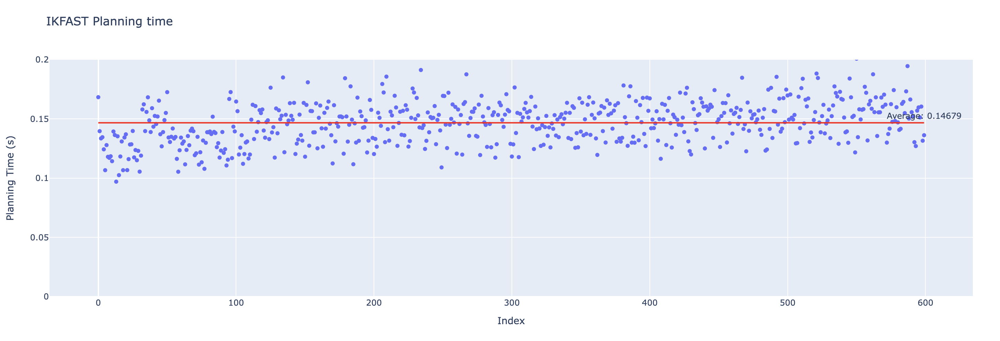
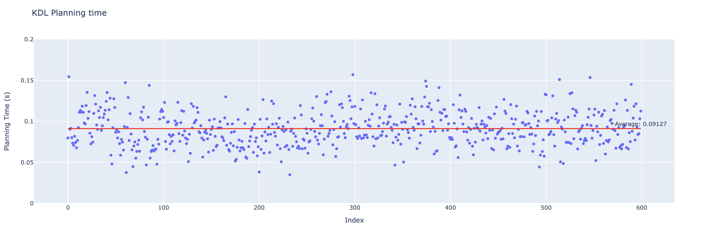
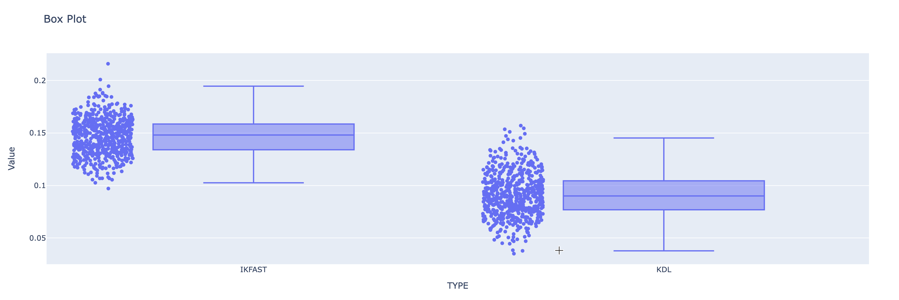

# Comparing IKFAST Kinematics Solver and KDL Kinematics Solver
This document presents the results of testing and comparing the IKFAST and KDL kinematics solvers using the Panda robotic arm. The comparison highlights the planning time and deviation of each solver in determining the arm's kinematic configurations.

## Testing Method
For the evaluation, I iterated through various initial configurations within the specified sample range, planning each configuration towards the input goal. For each initial configuration, I logged both the success value and the planning time.

## Results

### Planning time comparition
#### - IKFAST average planning time results 

I conducted 600 tests with different initial configurations, each planning towards the same sample goal. The results were visualized by plotting the planning time for each test. The average planning time across all tests was calculated to be 0.14679 seconds.

#### - KDL average planning time results

I conducted 600 tests with various initial configurations, planning towards the same sample goal, and visualized the results by plotting the planning time for each test. The average planning time for the KDL kinematics solver was 0.09127 seconds. In comparison, the same set of tests with the IKFAST solver resulted in an average planning time of 0.14679 seconds, which is slower than KDL.

### Average deviation comparition

The results indicate that the deviation in IKFAST is less than that of KDL.
